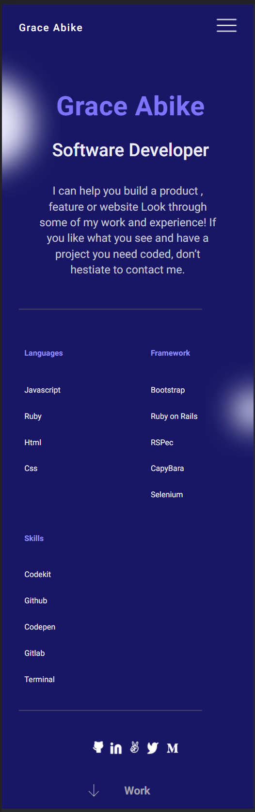

## Project : Portfolio

## For the third milestone of the portfolio website, I have:
- Add a contact form to my portfolio and the portfolio of my coding partner.
### The section that I have built for this milestone is:
- The Contact Us Form for the mobile version :

## Description
For this repository, I've created html templates and styling files in order to built a responsive portfolio,  which can help to easy explorate  profile differents devices.

## Built With
- HTML
- CSS
- Git & Github

### Live Demo

[Live Demo link](https://github.com/GraceAbike/Portfolio.git)
## Getting Started
To get a local copy up and running follow these simple example steps.
- Create a new GitHub repo.
- Create a new branch according to the GitHub flow rules.
- Add a .gitignore file.
- Set up a linter for HTML and CSS and make sure that any files that are not relevant are ignored by git.
- Add descriptive README file to your project - please use this template but remember to customize it to your project.
A .css file that includes one class with styles for your header .
- Make sure that the last file is actually ignored by git and is not present in your GitHub repository.
- Open a pull request.

### Install
To get a local copy up and running follow these simple example steps.
- Open terminal
- Clone this project by the command.

### prerequisites
- IDE to edit and run the code (We use Visual Studio Code 🔥).
- Git to versionning your work.
### usege
- For anyone who wants to practice html5 or/and css3
- For anyone who wants to create his own portfolio.
## Authors

👤 **Grace Abike**

- GitHub: [@GraceAbike](https://github.com/GraceAbike)
- Twitter: [@GraceAbike1](https://twitter.com/GraceAbike1)
- LinkedIn: [Grace Abike](https://www.linkedin.com/in/grace-abike-02770522a/)
- Angel: [Grace-Abike](https://angel.co/u/grace-abike)
## 🤝 Contributing

Contributions, issues, and feature requests are welcome!

Feel free to check the issues page.

## Show your support

Give a ⭐️ if you like this project!

## Acknowledgments

Hat tip to anyone whose code was used.
- Inspiration 💘
- Microverse program ⚡
- All my team 🏹
- My family's support 🙌
## 📝 License

This project is [MIT] licensed.
